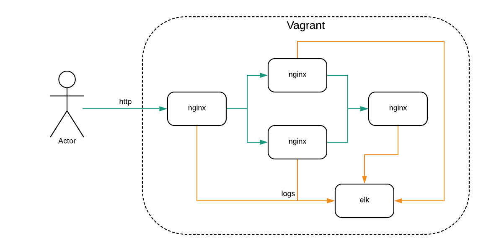

devops-test
---
Тестовое задание на должность DevOps инженер.

### Условия
- Использование Vagrant для виртуализации;
- Использование Ansible для `provisioning`.

### Задача

Необходимо поднять несколько Nginx веб-серверов. Первый Nginx принимает запросы от клинетов и занимается балансирвкой трафика между вторым и третим Nginx. 
На последнем Nginx находится простая `html` страница, которая отдается по запросу.

Так же необходимо поднять централизованную систему логирования. Втесто ELK стека можно использовать любую другую технологию.
